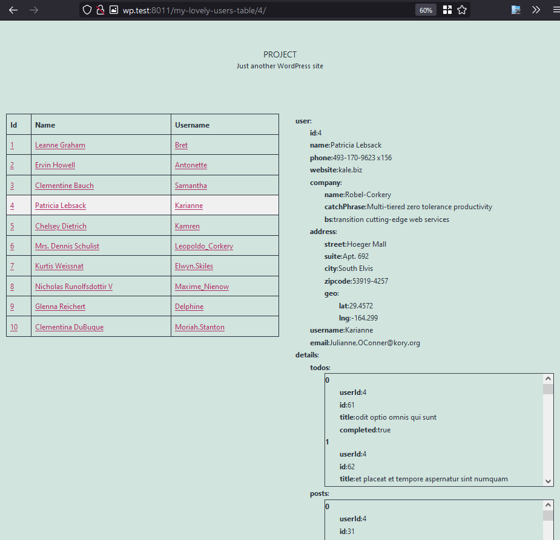

# MyPlugin
Sample integration with [jsonplaceholder.typicode.com](https://jsonplaceholder.typicode.com/).

This plugin will add new URL (`your-wp-site.com/my-lovely-users-table`) to your WordPress insalation.



# Getting Started
These instructions will get you a copy of the project up and running on your
local machine for development and testing purposes. See **Installation** for notes on
how to deploy the project on a live system.

# Installation
- Copy this repo
- Get [Composer](https://getcomposer.org/)
- run `composer install` in plugin root directory
- 🥂

# Template customization
This plugin supports custom template provided by user' theme
Any of the following files will be used **instead** if they are present in current theme directory

- `Yutsuku/WordPress/MyPlugin/index.php` main template file
- `Yutsuku/WordPress/MyPlugin/css/main.css`
- `Yutsuku/WordPress/MyPlugin/js/main.js` will be loades as a **module**

# Composer packages

Production:
- `symfony/http-client` default HTTP client for `Yutsuku\WordPress\Fetcher\Factory`
- `nyholm/psr7` symfony HTTP client to PSR adapter
- `psr/http-client` PSR standard HTTP client interface
- `psr/http-factory` PSR standard HTTP client interface

Development:
- `inpsyde/php-coding-standards` let's have consistent code style
- `brain/monkey` wordpress-specific testing and mocking
- `phpunit/phpunit` general purpose testing

# Development
## Sandbox environment

Running WordPress with this plugin locally, all changes to the plugin are instant.
To start up your local environment do the following:

* Copy `.env.dist` to `.env` and change values as necessary 
* execute following command

```
docker-compose up -d
```

By now, WordPress should be running at [wp.test:8011](http://wp.test:8011/).
You *should* edit your `/etc/host` file for this.

To stop the WordPress from running, use

```
docker-compose down
```

## Using wp-cli and composer inside the container.

Following command will drop you into container right inside plugin directory.
Use composer and wp-cli as it was installed globally: `composer require ...`

```
docker-compose run --rm cli sh
```

## Cleaning up

At some point you may want to completly remove current testing environment. To do
so execute following commands to ensure removal of presistent
[Docker Volumes](https://docs.docker.com/storage/volumes/).

```
docker volume rm wp-test_db_data
docker volume rm wp-test_wordpress_data
```

## Running tests & code standards

**NOTE:** While using Docker for development, enter container first to execute
following commands.

Running PHP CodeSniffer (phpcs) - code standards

```
./vendor/bin/phpcs
````

Running tests

```
./vendor/bin/phpunit
````
